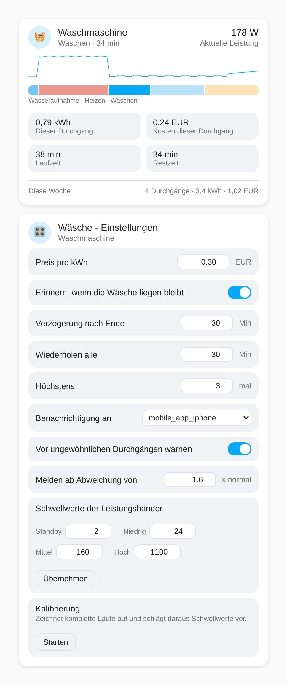
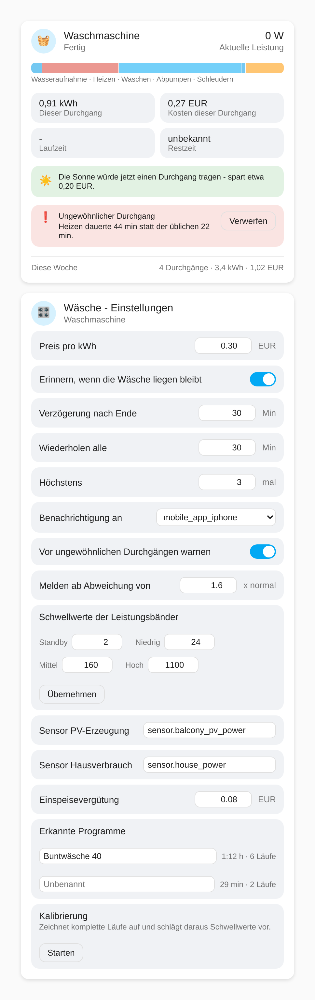

# Wäsche-Assistent

*[English version](README.md)*

Home-Assistant-Integration, die aus einer gewöhnlichen Steckdose mit
Leistungsmessung ablesbar macht, was Waschmaschine oder Trockner gerade
tatsächlich tun - in welcher Phase sie stecken, wie lange es noch dauert und
was der Durchgang gekostet hat.

> **Status: gegen synthetische Kurven geprüft, nicht an echter Hardware.**
> Erkennungsregeln, Lauferfassung, Energieintegration, Restzeitschätzung und
> Kalibrierung wurden in einem Home-Assistant-Container mit dem
> Replay-Werkzeug unter `tools/` durchgespielt - dabei kamen drei echte
> Fehler in den Übergangsregeln heraus, die behoben sind - und sind von der
> Testsuite abgedeckt. Die Karten unten sind aus dem echten Kartencode
> gerendert. Was *nicht* stattgefunden hat: ein Lauf an einer echten
> Waschmaschine oder einem echten Trockner. Ob Schwellwerte und Regeln zu
> deiner Maschine passen, ist also weiterhin offen.




*Die Zeitleiste von links nach rechts: Wasseraufnahme, Heizen, Waschen,
Abpumpen, Schleudern. `screenshots/demo.html` ist eine eigenständige Kopie
der echten Karten, die sich in jedem Browser öffnen lässt - ohne
Home-Assistant-Instanz. Die Symbole sind dort und in diesen Screenshots
Emoji-Platzhalter; Home Assistant zeichnet echte MDI-Vektoren.*

## Warum

Eine Steckdose mit Leistungsmessung sagt schon, ob ein Gerät Strom zieht, und
die meisten Setups hören genau da auf: Ein Template-Sensor kippt einen
Binärsensor über ein paar Watt auf `on` und darunter wieder auf `off`. Das
beantwortet "läuft sie?", aber nicht die Fragen, die man während des Laufs
wirklich hat:

- Heizt sie noch, oder schleudert sie schon?
- Wie lange habe ich noch, bevor ich danach schauen muss?
- Was hat dieser Durchgang gekostet?
- Liegt die Wäsche schon wieder seit Stunden in der Trommel?

All das steckt bereits in der Leistungskurve - ohne Geräte-API, ohne
Hersteller-Cloud, ohne Eingriff in die Hardware.

## Wie die Phasenerkennung funktioniert

Die Momentanleistung allein ist mehrdeutig: 350 W können die Laugenpumpe beim
Abpumpen sein oder der beginnende Schleudergang. Eindeutig wird es erst durch
die *Reihenfolge*. Die Erkennung läuft deshalb in zwei Stufen.

**1. Jeder Messwert wird in ein Band einsortiert** - `off`, `standby`, `low`,
`medium`, `high`. Ein Bandwechsel zählt erst, wenn er 15 Sekunden hält. Das
schluckt einzelne Ausreißer (Heizstab schaltet, Kompressor läuft an), ohne
die Rohwerte vorher filtern zu müssen.

**2. Eine Zustandsmaschine mit Gedächtnis leitet die Phase ab** - aus dem
aktuellen Band, wie lange es schon anliegt, und was in diesem Lauf vorher
schon passiert ist:

| Phase | Woran sie erkannt wird |
|---|---|
| Wasseraufnahme | `low`, bevor überhaupt geheizt wurde |
| Heizen | `high`, über Minuten - nichts sonst im Waschgang zieht zwei Kilowatt |
| Waschen | Wechsel zwischen `low` und `medium`, *nachdem* geheizt wurde. Jede Trommelumkehr schiebt die Leistung kurz nach `medium`, deshalb muss `medium` einen einzelnen Stoß überdauern, um die Waschphase zu beenden |
| Abpumpen | `medium` hält länger als ein Stoß, aber noch nicht lange genug für einen Schleudergang |
| Schleudern | `medium`, das länger hält, als ein Abpumpstoß dauern kann. Wechselt es danach wieder zwischen `low` und `medium`, war es ein Zwischenschleudern und das Waschen geht weiter |
| Fertig | zurück auf `standby` oder darunter, für vier Minuten |

Ein Trockner durchläuft mit eigenen Regeln `Heizen`, `Trocknen` und
`Abkühlen`. Die beiden verbreiteten Bauarten unterscheiden sich um den Faktor
drei - ein Wärmepumpentrockner zieht recht konstant 500-900 W, ein
Kondenstrockner taktet bei 2000-2600 W - aber beide enden mit einer deutlich
niedrigeren Abkühlphase, in der nur noch die Trommel dreht. Genau das macht
das Ende des Programms in beiden Fällen erkennbar.

Wo das Muster nicht passt, wird bewusst die generische Phase `Läuft` mit
niedriger Konfidenz gemeldet statt einer konkreten Phase, die vermutlich
falsch wäre. Deshalb trägt jede Phase ein Attribut `confidence`.

### Schwellwerte werden kalibriert, nicht geraten

Die Bandgrenzen hängen vom Gerät ab und sind deshalb nicht fest verdrahtet.
Pro Gerätetyp gibt es Startwerte, und ein Kalibriermodus zeichnet die
nächsten drei kompletten Läufe auf und schlägt daraus Grenzen vor, abgeleitet
von der beobachteten Spitzenlast. Der Vorschlag wird zur Bestätigung
angezeigt und lässt sich von Hand überschreiben - er ist ein Ausgangspunkt,
keine Messung.

### Die Restzeit wird gelernt

Es gibt keine Programmtabelle. Jeder abgeschlossene Lauf wird mit seiner
Phasenabfolge gespeichert; ein Lauf, dessen Abfolge bisher zu einem
gespeicherten passt, wird insgesamt ungefähr genauso lange dauern. Solange
kein vergleichbarer Lauf existiert, meldet die Restzeit `unbekannt`, statt
sich eine Zahl auszudenken.

## Voraussetzungen

- Eine Steckdose, die die **Wirkleistung in Watt** als eigene Sensor-Entität
  meldet (`device_class: power`). Sensoren in kW werden erkannt und
  umgerechnet.
- Er muss entweder **bei Änderung** melden oder in einem Takt von
  **höchstens 30 Sekunden**

Tasmota sendet standardmäßig alle 300 Sekunden Telemetrie. In dem Takt liegt
ein kompletter Schleudergang zwischen zwei Messwerten und ist schlicht
unsichtbar. Also entweder den Takt verkürzen:

```
TelePeriod 10
```

oder besser, bei Änderung senden:

```
PowerDelta 10
```

Melden bei Änderung ist die bessere Wahl: Jeder Übergang wird exakt
erfasst, und dazwischen gibt es nichts zu melden, weil die Last tatsächlich
konstant ist. Die Integration wertet nach eigener Uhr aus statt nur beim
Eintreffen eines Messwerts - die langen Funkstillen einer solchen Steckdose
werden also korrekt behandelt, einschließlich der vier Minuten Ruhe am Ende
eines Durchgangs, in denen ein ereignisgesteuerter Sensor überhaupt nichts
sendet.

Die Karte warnt, wenn ein **zeitgesteuerter** Sensor zu langsam eingestellt
ist. Bei einem ereignisgesteuerten warnt sie nicht - dessen Lücken sind
flache Phasen, keine zu grobe Einstellung.

## Funktionen

- **Phasen-Sensor** mit aktueller Phase und Konfidenzwert
- **Restzeit**, gelernt aus früheren Läufen desselben Geräts
- **Energie und Kosten pro Durchgang**, per Trapezintegration der
  Leistungskurve und einem einstellbaren Preis pro kWh
- **Wochensummen**: Durchgänge, Energie und Kosten
- **Erinnerung**, wenn die Wäsche in der Trommel liegen bleibt - Verzögerung,
  Wiederholungsabstand und maximale Anzahl einstellbar, an einen
  `notify.mobile_app_*`-Dienst deiner Wahl, standardmäßig an keinen. Sie
  endet, sobald das Gerät ausgeschaltet wird oder ein optionaler Türsensor
  öffnet.
- **Zwei Lovelace-Karten**: eine reine Status-Karte (Phasen-Zeitleiste, Live-
  Leistungskurve, Kennzahlen zum Durchgang, Wochenübersicht) und eine
  Einstellungs-Karte (Preis, Erinnerung, Schwellwerte, Kalibrierung)
- **Kalibriermodus**, der Bandgrenzen aus deinen eigenen Läufen vorschlägt
- **Programm-Erkennung**: Läufe werden nach Phasenabfolge *und* Phasendauern
  gruppiert, ein Kurzprogramm also nie mit einem Koch-/Buntwäscheprogramm
  gemittelt. Einmal benannt, werden passende Läufe automatisch zugeordnet -
  und die Restzeit stützt sich auf diese Gruppe statt auf die ganze Historie.
- **Gesamtenergie-Sensor** mit `state_class: total_increasing`, für das
  Energie-Dashboard von Home Assistant
- **PV-Überschuss-Vorschlag**: Mit konfiguriertem Erzeugungssensor schaltet
  ein Binärsensor auf `an`, sobald der Überschuss die typische Leistung
  dieses Geräts fünf Minuten lang gedeckt hat. Die angezeigte Ersparnis ist
  die Differenz zwischen deinem Strompreis und der Einspeisevergütung -
  nicht der volle Preis. Er schlägt nur vor; Einschalten ist bewusst nicht
  vorgesehen.
- **Abweichungs-Warnungen**: Jeder abgeschlossene Lauf wird mit gespeicherten
  Läufen derselben Phasenabfolge verglichen, ein Kurzprogramm also nie an
  einem Koch-/Buntwäscheprogramm gemessen. Fängt die schleichenden
  Veränderungen ab, die man selbst nicht bemerkt - eine Heizphase, die über
  Monate länger wird, weil der Heizstab verkalkt, ein doppelt so langes
  Abpumpen, ein Durchgang, der ohne Schleudern endet. Meldet nichts, solange
  keine fünf vergleichbaren Läufe vorliegen.

## Entitäten

Jedes Gerät ist ein eigener Konfigurationseintrag und erzeugt ein Gerät mit
sieben Sensoren:

| Entität | Beschreibung |
|---|---|
| `sensor.<name>_phase` | Aktuelle Phase. Trägt alle Attribute, die die Karten lesen. |
| `sensor.<name>_restzeit` | Geschätzte verbleibende Minuten, oder unbekannt |
| `sensor.<name>_energie_pro_durchgang` | kWh des aktuellen oder letzten Durchgangs |
| `sensor.<name>_kosten_pro_durchgang` | Kosten des aktuellen oder letzten Durchgangs |
| `sensor.<name>_durchgange_diese_woche` | Abgeschlossene Läufe diese Woche |
| `sensor.<name>_energie_diese_woche` | kWh diese Woche |
| `sensor.<name>_kosten_diese_woche` | Kosten diese Woche |
| `sensor.<name>_gesamtenergie` | kWh über alle Durchgänge - der Sensor fürs Energie-Dashboard |
| `binary_sensor.<name>_sonne_deckt_einen_durchgang` | An, wenn PV-Überschuss einen Durchgang tragen würde |

`cycle_energy` trägt bewusst **keine** `device_class: energy`: Die ist
Zählern vorbehalten, die nur hochlaufen, und dieser Wert wird pro Durchgang
zurückgesetzt. Fürs Energie-Dashboard `total_energy` verwenden. Das Löschen
der Historie lässt `total_energy` absichtlich unangetastet - ein Zähler, der
rückwärts springt, macht die Langzeitstatistik unrettbar kaputt.

Die Woche beginnt am Montag. Home Assistant stellt Integrationen den ersten
Wochentag der Locale nicht bereit, also musste einer gewählt werden.

## Dienste

Alle Dienste erwarten die `entry_id` des Geräts, die der Phasen-Sensor als
Attribut bereitstellt.

| Dienst | Zweck |
|---|---|
| `laundry_assistant.set_price` | Preis pro kWh, optional die Währung |
| `laundry_assistant.set_reminder` | Trommel-Erinnerung aktivieren und einstellen |
| `laundry_assistant.set_notify_target` | Welcher `notify.mobile_app_*`-Dienst benachrichtigt |
| `laundry_assistant.set_thresholds` | Bandgrenzen in Watt |
| `laundry_assistant.start_calibration` | Aufzeichnung starten |
| `laundry_assistant.cancel_calibration` | Abbrechen und verwerfen |
| `laundry_assistant.apply_calibration` | Vorgeschlagene Schwellwerte übernehmen |
| `laundry_assistant.dismiss_reminder` | Laufende Erinnerung abbrechen |
| `laundry_assistant.set_anomaly_detection` | Abweichungs-Warnungen aktivieren und Empfindlichkeit setzen |
| `laundry_assistant.dismiss_anomalies` | Meldungen des letzten Laufs verwerfen |
| `laundry_assistant.set_program_name` | Einem erkannten Programm einen Namen geben |
| `laundry_assistant.set_solar` | Erzeugungs- und Verbrauchssensor zuweisen |
| `laundry_assistant.clear_history` | Alle gespeicherten Läufe löschen (Gesamtzähler bleibt) |

## Installation

Noch nicht veröffentlicht. Sobald es an echter Hardware funktioniert, wird es
als einzelner HACS-Eintrag der Kategorie **Integration** installierbar sein,
mit den Karten im Paket, die sich beim Start selbst registrieren - dieselbe
Verpackung wie bei
[ha-irrigation-sequencer](https://github.com/ReneSattler/ha-irrigation-sequencer).

Bis dahin `custom_components/laundry_assistant` nach
`config/custom_components/` kopieren und Home Assistant neu starten. Dabei
**"Home Assistant neu starten"** verwenden, nicht "Schnellneustart" -
letzterer lädt nur YAML neu und würde weiter den alten Python-Code ausführen.

Danach **Einstellungen → Geräte & Dienste → Integration hinzufügen**, nach
"Laundry Assistant" suchen, Waschmaschine oder Trockner wählen und den
Leistungssensor der Steckdose auswählen.

## Testen

`docker-compose.yml` startet eine Wegwerf-Instanz von Home Assistant, in
deren Konfigurationsverzeichnis dieses Repository eingehängt wird:

```bash
docker compose up
```

Home Assistant läuft dann auf <http://localhost:8123>. Da die echten Geräte
aus dem Container nicht erreichbar sind, legt man dort einen
`input_number`-Helfer an und richtet die Integration darauf aus, um einen
Durchgang von Hand durchzuspielen. Siehe
[Issue #13](https://github.com/ReneSattler/ha-laundry-assistant/issues/13).

Das Repository ist zusätzlich unter `/repo` eingehängt, sodass das
Replay-Werkzeug ohne diese Einrichtung direkt gegen die echte
Manager-Klasse laufen kann:

```bash
docker compose exec homeassistant python /repo/tools/replay_cycles.py
```

`replay_cycles.py` schickt synthetische Wasch- und Trocknerkurven durch die
Erkennung und gibt die entstehenden Phasen-Zeitleisten aus;
`replay_behaviour.py` deckt Restzeit-Lernen, Kalibrierung, Wochensummen,
kW-Sensoren, ein zu grobes Update-Intervall und einen kurzen Stromstoß ab,
der nicht als Lauf gezählt werden darf.

### Gegen die eigene Maschine testen

Synthetische Kurven belegen nur, dass der Code tut, wofür er geschrieben
wurde. Ob die Regeln zu einer echten Maschine passen, zeigt sich erst, wenn
man ihre aufgezeichnete Historie in ein Fixture verwandelt und abspielt. Auf
einer *Kopie* der Datenbank arbeiten - Home Assistant hält die laufende
geöffnet.

```bash
python tools/export_history.py home-assistant_v2.db sensor.waschmaschine_leistung --out tests/fixtures
```

Das Skript zerlegt die Historie in Läufe, schreibt je eine CSV und meldet
pro Lauf den mittleren Messabstand - eine zu grobe Aufzeichnung fällt so
auf, statt still zu bleiben. Danach einen Lauf abspielen:

```bash
docker compose exec homeassistant python /repo/tools/replay_fixture.py /repo/tests/fixtures/<datei>.csv --type washer
```

Die ausgegebene Zeitleiste mit dem vergleichen, was die Maschine wirklich
getan hat. Weichen sie ab, leitet `--calibrate` die Schwellwerte aus genau
diesem Fixture ab. Achtung: Der Recorder räumt standardmäßig nach zehn Tagen
auf - alles Ältere ist bereits weg.

## Lizenz

MIT - siehe [LICENSE](LICENSE).

## Screenshots neu erzeugen

Die Screenshots entstehen aus `screenshots/demo.html`, das den echten
Kartencode mit einem Mock-`hass` lädt - sie können also nicht auseinander
laufen mit dem, was die Karten tatsächlich tun. Ein veralteter Screenshot
mit einer älteren Oberfläche ist eine eigene Art von falscher Doku.

```bash
docker run --rm -v "$PWD:/repo" -w /repo mcr.microsoft.com/playwright/python:latest bash -c "pip install -q --break-system-packages playwright==1.46.0 && python screenshots/render.py"
```

Die Playwright-Version muss zu den im Image enthaltenen Browsern passen -
deshalb ist sie festgenagelt und nicht einfach `playwright`.
