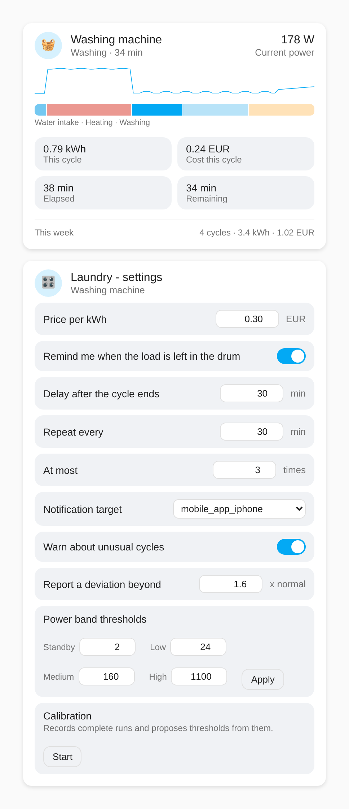
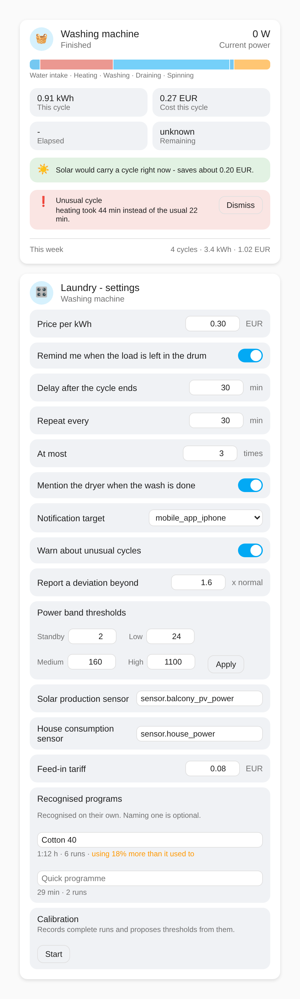

# Laundry Assistant

*[Deutsche Version](README.de.md)*

Home Assistant integration that turns a plain power-metering smart plug into
a detailed view of what your washing machine or tumble dryer is actually
doing - which phase it is in, how much longer it will run, and what the
cycle cost.

> **Status: verified against synthetic curves, not against real hardware.**
> The detection rules, run tracking, energy integration, remaining-time
> estimation and calibration have been exercised in a Home Assistant
> container using the replay harness under `tools/` - which found and fixed
> three real bugs in the transition rules - and are covered by the test
> suite. The cards below are rendered from the real card code. What has
> *not* happened is a run against an actual washing machine or dryer, so
> whether the thresholds and rules match your machine is still open.




*Left to right in the timeline: water intake, heating, washing, draining,
spinning. `screenshots/demo.html` is a standalone copy of the real cards you
can open in any browser to try them out without a Home Assistant instance.
The icons are emoji stand-ins there and in these screenshots; Home Assistant
draws proper MDI vectors.*

## Why

A power-metering plug already tells you whether an appliance draws current,
and most setups stop there: a template sensor flips a binary sensor to `on`
above a few watts and back to `off` below it. That answers "is it running?"
but not the questions you actually have while the machine runs:

- Is it still heating, or already spinning?
- How much longer do I have before I need to be there?
- What did this cycle cost?
- Did I forget the load in the drum again?

All of that is recoverable from the power curve alone - no appliance API, no
manufacturer cloud, no hardware modification.

## How phase detection works

The instantaneous wattage is ambiguous on its own: 350 W is either the pump
draining or a spin cycle ramping up. What disambiguates it is the *sequence*.
Detection therefore runs in two stages.

**1. Every reading is sorted into a band** - `off`, `standby`, `low`,
`medium`, `high`. A band change only counts once it has held for 15 seconds,
which swallows single-sample spikes (a heating element switching, a
compressor starting) without filtering the raw values first.

**2. A state machine with memory derives the phase** from the current band,
how long it has held, and what the run has already been through:

| Phase | What identifies it |
|---|---|
| Water intake | `low`, before any heating has occurred |
| Heating | `high`, sustained - nothing else in a wash cycle draws two kilowatts |
| Washing | alternation between `low` and `medium`, *after* heating. Each drum reversal briefly pushes the draw into `medium`, so leaving the wash needs `medium` to outlast a single burst |
| Draining | `medium` sustained past a burst, but not yet long enough to be a spin |
| Spinning | `medium` that holds longer than a drain pulse could. Repeated `low`/`medium` alternation afterwards means it was an intermediate spin and washing continues |
| Finished | back to `standby` or below, for four minutes |

A tumble dryer runs through `heating`, `drying` and `cooldown` with its own
rules. The two common dryer types differ by a factor of three - a heat-pump
model draws a fairly constant 500-900 W, a condenser model cycles at
2000-2600 W - but both end with a clearly lower cool-down where only the drum
still turns, which is what makes the end of the cycle detectable either way.

Where the pattern does not match, the phase reported is a generic `running`
with low confidence, rather than a specific phase that is probably wrong.
Every phase carries a `confidence` attribute for this reason.

### Thresholds are calibrated, not guessed

The band edges depend on the appliance, so they are not hard-coded. Starting
values ship per appliance type, and a calibration mode records the next three
complete runs and proposes edges derived from the observed peak load. The
proposal is shown for confirmation and can be overridden by hand - it is a
starting point, not a measurement.

### Remaining time is learned

There is no program table. Each completed run is stored with its phase
timeline; a run whose phase sequence matches a stored one so far is expected
to take about as long in total. Until a comparable run exists, remaining time
reports `unknown` rather than inventing a number.

## Requirements

- A smart plug that reports **active power in watts** as its own sensor
  entity (`device_class: power`). Sensors reporting kW are accepted and
  converted.
- That sensor must update **at least every 30 seconds**

The second point is the one that trips people up. Tasmota sends telemetry
every 300 seconds by default - at that rate a spin cycle passes between two
samples and is simply invisible. On Tasmota devices, set:

```
TelePeriod 10
```

or, better, push on change instead of on a timer:

```
PowerDelta 10
```

Other firmware has equivalent settings. The card shows a warning when the
observed median update interval is too coarse for reliable detection.

## Features

- **Phase sensor** with the current phase and a confidence value
- **Remaining time**, learned from previous runs of the same appliance
- **Energy and cost per cycle**, from trapezoidal integration of the power
  curve and a configurable price per kWh
- **Weekly totals**: cycles, energy and cost
- **Reminder** when the load is left in the drum - configurable delay,
  repeat interval and maximum repeats, sent to a `notify.mobile_app_*`
  service of your choice, defaulting to none. It stops when the appliance is
  switched off, or when an optional door sensor opens.
- **Two Lovelace cards**: a read-only status card (phase timeline, live power
  curve, cycle figures, weekly summary) and a settings card (price, reminder,
  thresholds, calibration)
- **Calibration mode** that proposes band thresholds from your own runs
- **Deviation warnings**: each finished run is compared against stored runs
  with the same phase sequence, so a quick wash is never judged against a
  cotton program. Catches the slow drifts nobody notices by eye - a heating
  phase creeping longer as the element scales up, a drain taking twice as
  long, a cycle that ends without a spin. Says nothing until five comparable
  runs exist.

## Entities

Each appliance is a separate config entry and creates one device with seven
sensors:

| Entity | Description |
|---|---|
| `sensor.<name>_phase` | Current phase. Carries every attribute the cards read. |
| `sensor.<name>_remaining_time` | Estimated minutes left, or unknown |
| `sensor.<name>_cycle_energy` | kWh of the current or last cycle |
| `sensor.<name>_cycle_cost` | Cost of the current or last cycle |
| `sensor.<name>_cycles_this_week` | Completed runs this week |
| `sensor.<name>_energy_this_week` | kWh this week |
| `sensor.<name>_cost_this_week` | Cost this week |

The week starts on Monday. Home Assistant does not expose the locale's first
day of week to integrations, so one had to be chosen.

## Services

All services take the `entry_id` of the appliance, which the phase sensor
exposes as an attribute.

| Service | Purpose |
|---|---|
| `laundry_assistant.set_price` | Price per kWh, and optionally the currency |
| `laundry_assistant.set_reminder` | Enable and configure the drum reminder |
| `laundry_assistant.set_notify_target` | Which `notify.mobile_app_*` service to use |
| `laundry_assistant.set_thresholds` | Band edges in watts |
| `laundry_assistant.start_calibration` | Begin recording runs |
| `laundry_assistant.cancel_calibration` | Stop and discard |
| `laundry_assistant.apply_calibration` | Adopt the proposed thresholds |
| `laundry_assistant.dismiss_reminder` | Cancel a pending reminder |
| `laundry_assistant.set_anomaly_detection` | Enable deviation warnings and set the sensitivity |
| `laundry_assistant.dismiss_anomalies` | Clear the findings from the last run |
| `laundry_assistant.clear_history` | Delete all stored runs |

## Installation

Not released yet. Once it works against real hardware it will be installable
as a single HACS integration entry, with the cards bundled inside it and
registering themselves on startup - the same packaging approach used by
[ha-irrigation-sequencer](https://github.com/ReneSattler/ha-irrigation-sequencer).

For now, copy `custom_components/laundry_assistant` into your
`config/custom_components/` directory and restart Home Assistant. Use
"Restart Home Assistant", not "Quick Reload" - the latter only reloads YAML
and would keep running the previous Python code.

Then go to **Settings → Devices & Services → Add Integration**, search for
"Laundry Assistant", pick washing machine or tumble dryer, and select the
plug's power sensor.

## Testing

`docker-compose.yml` starts a throwaway Home Assistant instance with this
repository bind-mounted into its config directory:

```bash
docker compose up
```

Home Assistant then runs on <http://localhost:8123>. Since the real
appliances are not reachable from that container, create an `input_number`
helper and point the integration at it to drive a cycle by hand. See
[issue #13](https://github.com/ReneSattler/ha-laundry-assistant/issues/13).

The repository is also mounted at `/repo`, so the replay harness can be run
against the real manager class without any of that setup:

```bash
docker compose exec homeassistant python /repo/tools/replay_cycles.py
```

`replay_cycles.py` feeds synthetic washer and dryer curves through the
detection pipeline and prints the resulting phase timelines;
`replay_behaviour.py` covers remaining-time learning, calibration, weekly
totals, kW-reporting sensors, a too-coarse update interval, and a brief
burst that must not be recorded as a run.

## License

MIT - see [LICENSE](LICENSE).

## Regenerating the screenshots

The screenshots are rendered from `screenshots/demo.html`, which loads the
real card code with a mocked `hass` object - so they cannot drift away from
what the cards actually do. A stale screenshot showing an older UI is its
own kind of wrong documentation.

```bash
docker run --rm -v "$PWD:/repo" -w /repo mcr.microsoft.com/playwright/python:latest bash -c "pip install -q --break-system-packages playwright==1.46.0 && python screenshots/render.py"
```

The pinned playwright version has to match the browsers baked into the
image, which is why it is not simply `playwright`.
